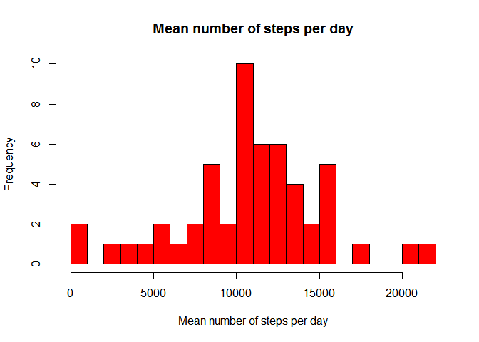
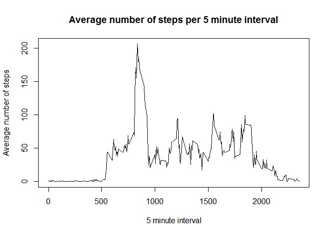
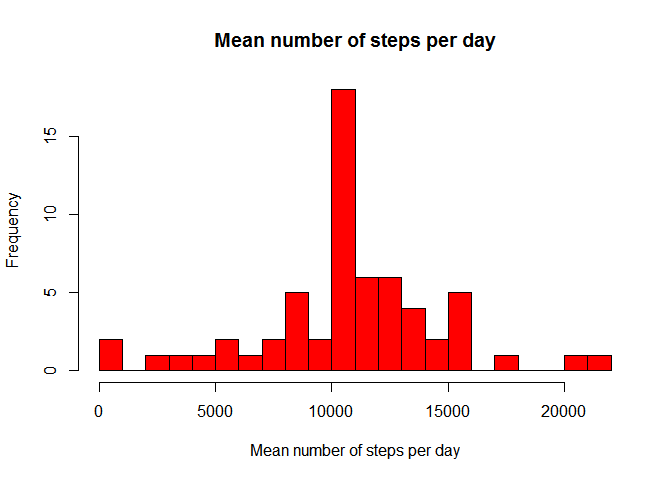
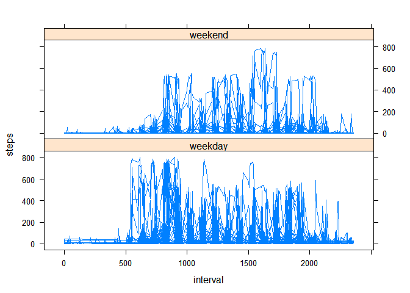

# Reproducible Research: Peer Assessment 1


## Loading and preprocessing the data
Load the activity.zip file into workspace.

```r
unzip("./Activity.zip")
```
        
# Read feature names and activity labels
Read the activity.csv into data.

```r
data <- read.csv("activity.csv")
```


## What is mean total number of steps taken per day?
Let's omit na from the data. Then we group the data per date and take the sum of steps per day. We plot into a histogram and finally take the mean and median of the aggregated data.

```r
x <- na.omit(data)
aggregate <- aggregate(steps ~ date, data = x, sum)
hist(aggregate$steps, breaks = 25, col = "red", xlab = "Mean number of steps per day", main = "Mean number of steps per day")
```

 

```r
mean(aggregate$steps)
```

```
## [1] 10766.19
```

```r
median(aggregate$steps)
```

```
## [1] 10765
```
The mean is 10766.19 and the median is 10765.


## What is the average daily activity pattern?
Let's get all complete cases from the original data. Then we group the data per interval and take the mean for each interval. Finally we make a plot of average number of steps per interval.

```r
completeCases <- data[complete.cases(data),]
completeAggregate <- aggregate(steps ~ interval, data = completeCases, mean)
plot(completeAggregate$interval, completeAggregate$steps, type = "l", col = "Black", main = "Average number of steps per 5 minute interval", xlab = "5 minute interval", ylab = "Average number of steps")    
```

 

#### Get index of max
We find the index of the max value for number of steps.

```r
index <- which.max(completeAggregate$steps)
index
```

```
## [1] 104
```

#### Get interval for max
We use the index to get the interval that corresponds to the max value.

```r
maxinterval <- completeAggregate$interval[index]
maxinterval
```

```
## [1] 835
```
The interval with the max value of average number of steps is interval 835.

#### Imputing missing values
We get the total number of na's in the data.

```r
na <- sum(is.na(data))
na
```

```
## [1] 2304
```
There are 2304 NA in the data set.

Let's impute the missing data with the mean for that interval.
First we define a function to replace the missing data with the mean.
Then we use plyr to create a new data frame with the imputed data.
We need to reorder the new data frame due the way plyr orders by group.
Finally we plot the data in a histogram and compute the mean and median.

```r
library(plyr)
impute.mean <- function(x) replace(x, is.na(x), mean(x, na.rm = TRUE))
imputeData <- ddply(data, ~interval, transform, steps = impute.mean(steps))
imputeData <- imputeData[with(imputeData, order(date, interval)), ] #plyr orders by group so we have to reorder

imputeAggregate <- aggregate(steps ~ date, data = imputeData, sum)
hist(imputeAggregate$steps, breaks = 20, col = "red", xlab = "Mean number of steps per day", main = "Mean number of steps per day")
```

 

```r
mean(imputeAggregate$steps)
```

```
## [1] 10766.19
```

```r
median(imputeAggregate$steps)
```

```
## [1] 10766.19
```
The mean is 10766.19 and the median is 10766.19 for the imputed data.
We can see that there is no difference in the mean or median as compared to the original data when using impute by mean value.

## Are there differences in activity patterns between weekdays and weekends?

Let's create a factor variable indicating whether a date is weekend or weekday and add to the imputed dataset.

```r
Sys.setlocale("LC_TIME", "English")
```

```
## [1] "English_United States.1252"
```

```r
imputeData$weekday <- weekdays(strptime(imputeData$date, format = "%Y-%m-%d"))
weekend <- imputeData$weekday == "Saturday" | imputeData$weekday == "Sunday"
imputeData$weekday[weekend] <- "weekend"
imputeData$weekday[!weekend] <- "weekday"
```
Make a panel plot for average number of steps per 5-minute interval averaged across all weekday/weekend days using lattice.

```r
require("lattice")
```

```
## Loading required package: lattice
```

```r
xyplot(steps ~ interval | weekday, data = imputeData, layout=c(1,2), type="l")
```

 

From the plot we can see that the activity pattern is highest on the mornings on the weekdays whereas the overall activity pattern is higher during the weekends in the afternoon.
